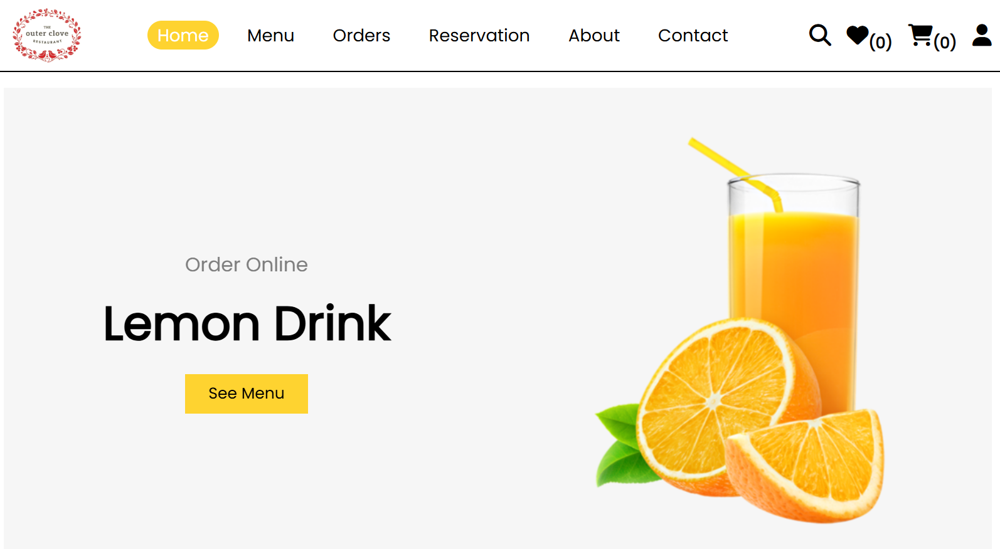
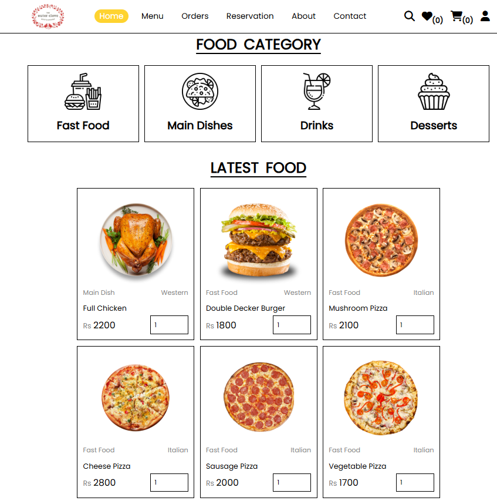
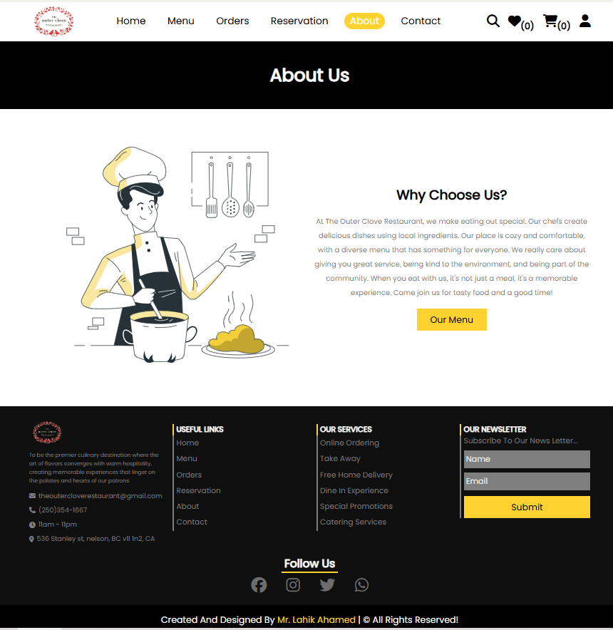
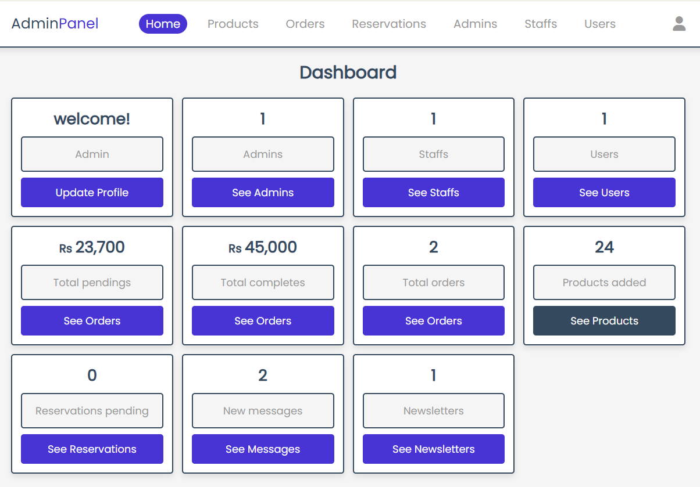
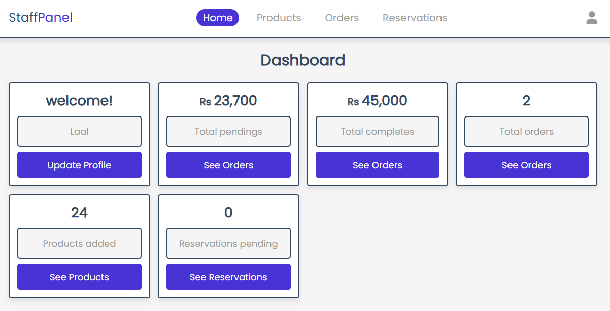
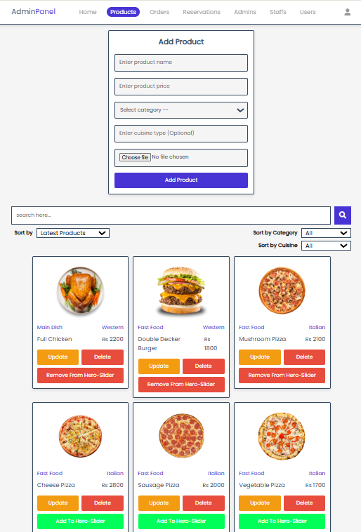

# Restaurant Management Web Application

## 1. Project Overview

This is a feature-rich educational restaurant management web application built with PHP and MySQL. The system enables customers to browse menus, place orders, make reservations, and manage their accounts, while administrators and staff can manage products, process orders, handle reservations, and track customer communications.

**Target Audience:** This project is designed for students learning web development, educational institutions, and developers seeking a practical example of a multi-role web application. It is intended for learning and demonstration purposes. Not ideal for production use.

**Main Features:**
- **Customer Portal:** User registration, menu browsing, shopping cart, order placement, reservation booking, wishlist management, and profile management
- **Admin Panel:** Product management, order processing, user account management, reservation handling, customer messaging, and basic newsletter subscription data management
- **Staff Portal:** View and manage placed orders, monitor reservations, and update their profiles
- **Database Management:** Complete MySQL database with normalized tables for users, products, orders, reservations, and communications
- **Role-Based Access:** Separate login systems for customers, administrators, and staff with session-based authentication

---

## 2. Tech Stack

**Backend:**
- PHP 7.x / 8.x
- PDO (PHP Data Objects) for database connectivity

**Database:**
- MySQL 5.7+ or MariaDB 10.3+

**Frontend:**
- HTML5
- CSS3
- JavaScript (vanilla)
- Font Awesome 6.1.1 for icons

**Server Requirements:**
- XAMPP, WAMP, Laragon, or any local development server with PHP and MySQL support
- Apache Web Server
- PHP extensions: PDO, PDO MySQL

---

## 3. Project Structure

```
Restaurant-website/
├── admin/                      # Admin panel pages
│   ├── admin_login.php        # Admin authentication
│   ├── admin_home.php         # Admin dashboard
│   ├── products.php           # Product management
│   ├── update_product.php     # Product editing
│   ├── placed_orders.php      # Order management
│   ├── reservations.php       # Reservation management
│   ├── messages.php           # Customer messages
│   ├── newsletters.php        # Newsletter management
│   ├── user_accounts.php      # User management
│   ├── staff_accounts.php     # Staff management
│   ├── admin_accounts.php     # Admin account management
│   └── ...
├── staff/                      # Staff panel pages
│   ├── staff_login.php        # Staff authentication
│   ├── staff_home.php         # Staff dashboard
│   ├── placed_orders.php      # View orders
│   ├── products.php           # View products
│   ├── reservations.php       # View reservations
│   └── ...
├── customer/                   # Customer-facing pages
│   ├── home.php               # Landing page
│   ├── login.php              # Customer login
│   ├── register.php           # Customer registration
│   ├── menu.php               # Menu browsing
│   ├── category.php           # Browse by category
│   ├── cuisine.php            # Browse by cuisine
│   ├── cart.php               # Shopping cart
│   ├── checkout.php           # Order checkout
│   ├── card_payment.php       # Payment processing
│   ├── order.php              # Order confirmation
│   ├── reservation.php        # Reservation booking
│   ├── profile.php            # User profile
│   ├── update_profile.php     # Profile editing
│   ├── update_address.php     # Address management
│   ├── wishlist.php           # Wishlist management
│   ├── contact.php            # Contact form
│   ├── search.php             # Search functionality
│   └── ...
├── components/                 # Reusable components
│   ├── user_header.php        # Customer navigation
│   ├── admin_header.php       # Admin navigation
│   ├── staff_header.php       # Staff navigation
│   ├── footer.php             # Footer component
│   ├── add_cart.php           # Add to cart logic
│   ├── add_wishlist.php       # Add to wishlist logic
│   └── ...
├── db/                        # Database configuration
│   ├── database.php           # PDO connection (primary)
│   └── databasesqli.php       # Alternative config
├── CSS/                       # Stylesheets
│   ├── customer_style.css     # Customer portal styling
│   └── admin_style.css        # Admin/Staff styling
├── js/                        # JavaScript files
│   ├── script.js              # Customer-side scripts
│   └── admin_script.js        # Admin-side scripts
├── uploaded images/           # User-uploaded images
└── restaurantdb.sql           # Database schema & initial data
```

---

## 4. Setup & Installation Guide

### Prerequisites
- Install XAMPP, WAMP, Laragon, or equivalent local server
- Ensure PHP 7.x or higher is installed
- Ensure MySQL/MariaDB is installed and running

### Step-by-Step Installation

#### Step 1: Clone or Download the Project
```bash
git clone https://github.com/lahik/restaurant-website.git
```
Or download the ZIP file and extract it.

#### Step 2: Move Project to Server Directory
Move the project folder to your web server's root directory:
- **XAMPP:** `C:\xampp\htdocs\` (Windows) or `/Applications/XAMPP/htdocs/` (macOS)
- **WAMP:** `C:\wamp64\www\` (Windows)
- **Laragon:** `C:\laragon\www\`

Example:
```
C:\xampp\htdocs\Restaurant-website\
```

#### Step 3: Start Apache and MySQL
- Open XAMPP/WAMP Control Panel
- Start **Apache** and **MySQL** services
- Ensure both show "Running" status

#### Step 4: Create a Database
1. Open your browser and navigate to `http://localhost/phpmyadmin`
2. Log in with your phpMyAdmin credentials (default: user: `root`, password: empty)
3. Click **New** to create a new database
4. Enter database name: `restaurantdb`
5. Click **Create**

#### Step 5: Import the SQL File
1. In phpMyAdmin, click on the `restaurantdb` database you just created
2. Click the **Import** tab
3. Click **Choose File** and select `restaurantdb.sql` from your project folder
4. Click **Import** to execute the SQL script
5. Verify that all tables (admin, users, products, orders, reservation, etc.) are created

#### Step 6: Configure Database Connection
1. Open `db/database.php` in a text editor
2. Ensure the database connection credentials match your setup:
   ```php
   $host = "localhost";
   $user = "root";
   $password = "";  // Your MySQL password (if any)
   $db = "restaurantdb";
   ```
3. Save the file

#### Step 7: Access the Application
Open your browser and navigate to:
- **Main Website:** `http://localhost/Restaurant-website/customer/home.php`
- **Admin Login:** `http://localhost/Restaurant-website/admin/admin_login.php`
- **Staff Login:** `http://localhost/Restaurant-website/staff/staff_login.php`

---

## 5. Database Setup

### Database File
The database schema and initial data are provided in the `restaurantdb.sql` file in the project root.

### Importing via phpMyAdmin
1. Log in to phpMyAdmin (`http://localhost/phpmyadmin`)
2. Create a new database named `restaurantdb`
3. Select the database
4. Click **Import**
5. Select `restaurantdb.sql` from your project folder
6. Click **Import** to load all tables and sample data

### Database Tables
The following tables are created:
- `admin` - Administrator accounts
- `users` - Customer user accounts
- `products` - Menu items and products
- `orders` - Customer orders
- `reservation` - Table reservations
- `staff` - Staff member accounts
- `wishlist` - Customer wishlists
- `newsletter` - Newsletter subscriptions
- `messages` - Customer contact messages

---

## 6. Admin & Staff Access

### Admin Portal
- **URL:** `http://localhost/Restaurant-website/admin/admin_login.php`
- **Username:** admin
- **Password:** admin1234

### Staff Portal
- **URL:** `http://localhost/Restaurant-website/staff/staff_login.php`
- Staff credentials must be created by the administrator

### Default Admin Credentials
The default admin account is seeded in the database during import:
- **Username:** admin
- **Password:** admin1234 (stored as a hashed value in the database)

**Note:** These are demo credentials for testing and learning purposes. Change them in a production environment.

---

## 7. Important Notes

### Educational & Demo Purpose
This project is built for educational and demonstration purposes. It is designed to help students understand:
- Multi-tier web application architecture
- Role-based access control
- Database design and normalization
- PHP and MySQL integration
- User authentication and session management

### Payment Gateway
The card payment system is simulated. It does not process real payments. For production use, integrate a real payment gateway such as Stripe, PayPal, or similar services.

### Not Production-Ready
This application should **not** be used in production without significant security improvements, including:
- Input validation and sanitization enhancements
- HTTPS/SSL encryption
- CSRF token implementation
- Rate limiting and DDoS protection
- Security headers and best practices
- Database query optimization
- Error logging and monitoring

### Browser Compatibility
Tested on modern browsers including Chrome, Firefox, Safari, and Edge.

---

## 8. Screenshots & Features








### Customer Features
- User registration and login
- Browse menu by cuisine and category
- Add items to cart and wishlist
- Checkout with multiple payment methods (Cash on Delivery, Card Payment, Take Away)
- Book table reservations
- Manage user profile and address
- Send messages to restaurant
- View order history

### Admin Features
- Manage products (add, edit, delete)
- Manage customer orders and order status
- Manage customer accounts
- Manage staff accounts
- View and respond to customer messages
- Manage reservations
- Manage newsletter subscribers

### Staff Features
- View placed orders
- View reservations
- Manage own profile

---

## 9. License

This project is licensed under the **MIT License**. You are free to use, modify, and distribute this project for educational and commercial purposes, with proper attribution.

---

## 10. Project Status

- **Built:** 2023
- **Published:** 2026
- **Version:** 1.0 (Demo/Educational)
- **Status:** Stable for learning and demonstration purposes

---

## Additional Resources

- **PHP Documentation:** https://www.php.net/docs.php
- **MySQL Documentation:** https://dev.mysql.com/doc/
- **XAMPP:** https://www.apachefriends.org/
- **phpMyAdmin:** https://www.phpmyadmin.net/

---

## Contact & Support

For questions or issues, please refer to the project documentation or reach out to the development team.

---

**Disclaimer:** This is an open-source educational project. Users are responsible for securing and maintaining their own installations. The developers are not responsible for any damage, data loss, or security breaches resulting from improper use or deployment.
